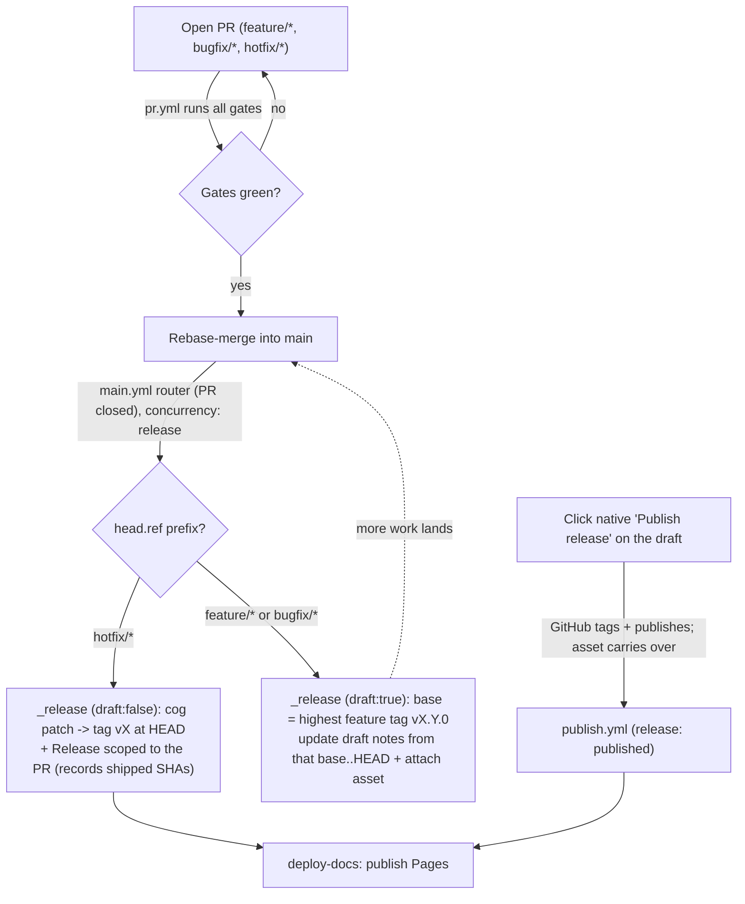

# CI/CD strategy: reusable-workflow gates, trunk-based rebase-only, tag-sourced releases

We run CI as a set of **reusable per-gate workflows** (`on: workflow_call`) composed by thin event orchestrators (`pr.yml`, `main.yml`, `publish.yml`), sharing one composite action (`.github/actions/setup`) for toolchain install; we develop **trunk-based** on a single `main` with **rebase-only** merges and linear history; and we release with the **git tag as the single source of truth** — a release *only* creates a tag `vX` and a GitHub Release, never a commit to `main`, so neither `VERSION` nor `CHANGELOG.md` is committed. `hotfix/*` PRs **auto-publish a patch release on merge**; `feature/*`/`bugfix/*` work accumulates in a **draft Release** published on demand from the native **"Publish release"** button. AI code review (CodeRabbit) acts as a blocking gate, not just comments. We chose this because it keeps each quality gate independently reusable and named by purpose, keeps history bisectable, and keeps exactly one home for the version (the tag) and the changelog (the Release) — eliminating the dual-source races of a committed `VERSION`/`CHANGELOG`, and needing **no privileged release bot** because releases never push to `main`.

This ADR is meant to be concrete enough that slices #4–#10 can wire their CI/release jobs with no further design.

## Workflow shape

- **Composite action** `.github/actions/setup/action.yml` — the shared environment block: runs `maintenance/install.sh --ci` (`brew bundle` from the `Brewfile` + vendor sync into `src/vendor/`, parity with local `just install --ci`) plus a Homebrew cache. Every gate calls it as its first step. The action is still named `setup` (GitHub Actions convention); the `just` recipe and script are `install` / `maintenance/install.sh`.
- **Reusable workflows** (`on: workflow_call`), each a single composable unit named by **purpose**, tool-agnostic. Their filenames carry a leading `_` to mark them as *callable* (never triggered directly), distinguishing them from the event orchestrators (`pr.yml`, `main.yml`, `publish.yml`). Two families:
  - _Gates_ (PR quality checks): `_gate-commit-lint`, `_gate-branch-lint`, `_gate-code-lint`, `_gate-format-check`, `_gate-test`, `_gate-generate-docs`.
  - _Deploy/release blocks_ (actions, not gates — they never block a PR): `_deploy-docs` (Pages) and **`_release`** — a single workflow whose **`draft` input selects the behavior**: `draft: true` updates the accumulating draft Release (a `feature/*`/`bugfix/*` merge); `draft: false` publishes a patch Release now (a `hotfix/*` merge). Kept out of the gate namespace precisely because they are not merge gates.
- **Event orchestrators** are thin — they only compose reusable workflows, never inline job bodies:
  - `pr.yml` (`on: pull_request`) calls every gate.
  - `main.yml` (the **merge router**, `on: pull_request: types: [closed]`, `if: merged`) reads the merged branch prefix: `hotfix/*` → `_release` with `draft: false` (+ `_deploy-docs`); anything else → `_release` with `draft: true`. (All branches target `main`, so a closed-and-merged PR is the single "landed on `main`" event.)
  - `publish.yml` (`on: release: published`) calls only `_deploy-docs` — the native "Publish release" button already created the tag and published the draft; the asset was pre-attached to the draft, so nothing else runs at publish.
- **Docs deploy on release, not on `main`**: `_deploy-docs` runs after a release is cut (from `publish.yml` on a feature publish, and chained after the hotfix `_release` in `main.yml` — a `GITHUB_TOKEN`-created release does not fire `release: published`). So GitHub Pages reflects the *released* version. Deploying on every merge would publish docs for unreleased/feature-flagged work sitting on the trunk. (The `_gate-generate-docs` PR check still verifies the docs *build* on every PR.)
- **Runners**: `ubuntu-latest` for every gate — no gate needs macOS.
- **Per-slice convention (fill-in the skeleton)**: the `_gate-*.yml` workflows ship now as valid running placeholders (each step just `echo …`) already wired into `pr.yml`. Each toolchain slice (#4–#9) replaces its placeholder body with the real `just` recipe / command, and only then is that check added to the branch-protection required-checks set.
- **Branch-name lint runs in both places**: the Lefthook `pre-push` hook gives fast, actionable feedback before a branch leaves the machine; `_gate-branch-lint` in CI is the unbypassable backstop that blocks a merge if a bad name slipped past a skipped or uninstalled hook. The branch prefix is also functional — base-branch resolution reads it (see `../branch-issue-resolution.md`).

## Development model and branch protection

- Trunk-based: single `main`, short-lived branches, **rebase-only** merges (squash and merge-commit disabled), linear history, `delete_branch_on_merge` on.
- Branch protection is enforced by a **ruleset** targeting `~DEFAULT_BRANCH` (so the `master`→`main` rename carried it over automatically): PR required (no direct push), no force-push or deletion, no bypass actors (administrators included), 0 required approvals.
- **Deltas applied as slices land**: add each gate to the required status-check set once its placeholder is replaced with real logic; enable required conversation resolution; optionally add an explicit linear-history rule. "Require branches to be up to date before merging" stays **off** (it serializes merges and forces constant rebases for little safety benefit on a low-traffic trunk).

## Code review policy

AI review acts as a **gate**, not just advisory comments. **CodeRabbit** is the reviewer: free forever on public repos, and its **Agentic Pre-Merge Checks** in `mode: error` (plus the Request Changes Workflow) produce a *failing* required status check — the only thing GitHub actually blocks a merge on (comments and neutral checks never block). Its check is added to the required-checks set once verified live on a PR. Human approvals stay at 0: the gate does the vetting, and CodeRabbit itself submits approve / request-changes.

CodeRabbit's coding-guideline detection is **directory-scoped** — a guideline file only governs the tree it lives in, and our authoritative rules/skills live under `.agents/` (no application code). So our standards are delivered two ways: (1) the review-relevant rules and skill criteria are distilled into `.coderabbit.yaml` → `reviews.instructions`, which is global and bypasses directory-scoping; and (2) `knowledge_base.code_guidelines.enabled` stays on so the root `AGENTS.md` and `.cursorrules` are auto-detected repo-wide. A generated root/`src` carrier synced from `.agents/rules` is recorded here as a **deferred option** if instruction drift becomes a problem.

GitHub Copilot review stays enabled as advisory comments only.

## Release model: tag-sourced, two flows

Supersedes #10's original "standing `chore(release)` PR" wording and the earlier draft-Release + committed-`VERSION` variant.

**Single source of truth = the git tag.** A release *only* creates a tag `vX` and a GitHub Release; it never commits to `main`. Nothing is committed as a version or changelog source: a committed `VERSION` or `CHANGELOG.md` would be a *second copy* of what the tag and the Release already hold, and that duplication is exactly what races and drifts (two `hotfix/*` PRs both writing `VERSION=1.2.1`, a stale pre-committed number, a tag/file mismatch). Instead:

- **Version**: `cog` **recomputes** the number at release time from the existing `v*` tags (never a pre-committed number); the build **stamps** it into the release asset (filename + a metadata line); `install.sh` **materializes** `~/.cli-setup/VERSION` on the user's machine from that stamped metadata, so `--version` and offline installs work without a `.git` present.
- **Changelog**: lives only in the GitHub Releases. `cog` generates the notes text for a commit range and writes it into the Release body — no committed file. The mdBook site may render a changelog page *derived* from the Releases at build time.

Because a release only tags + publishes (no push to `main`), it needs **no privileged bot**: the default `GITHUB_TOKEN` (`contents: write`) suffices and branch protection is never in play.

Two flows, both handled by the single `_release` workflow, routed by branch prefix on merge (all branches target `main`):

- **Hotfix — automatic** (`main.yml` router → `_release` with `draft: false`): merging a `hotfix/*` PR forces a **patch** (`cog`), tags `vX` at the new `main` HEAD, stamps + uploads the asset, and publishes a Release whose notes are **scoped to that PR** (and records the shipped commit SHAs in a hidden marker so the feature flow can de-dup them). It does **not** touch the accumulating feature draft. Then `_deploy-docs` runs.
- **Feature — on demand** (`main.yml` router → `_release` with `draft: true`): `feature/*` (and `bugfix/*`) merges accumulate into a **draft** Release (notes from the latest feature tag `vX.Y.0`..HEAD), and the draft run **stamps + attaches the asset** built for the pending version. When ready, the maintainer clicks the native **"Publish release"** button; GitHub creates the tag, flips the draft to published (the pre-attached asset carries over), and `publish.yml` deploys the docs. No `_release` run happens at publish time.

**The feature-notes base (no cursor).** Feature notes come from the latest **feature tag** `vX.Y.0`..HEAD. Because a feature release always bumps at least a minor and a hotfix always bumps a patch (see the amendment below), the base is *derivable* — it is the commit of the highest `v*` tag whose patch component is `0` — so no separate cursor tag is maintained. If no feature tag exists yet, notes cover the full history. Interleaved hotfix `vX.Y.Z` tags never move the base, so the draft keeps its accumulated features. De-dup is **by commit SHA**: each hotfix Release records the commit SHAs it shipped in a hidden marker, and the draft recompute drops those commits from its notes, so a `fix:` shipped by a hotfix never reappears in the next feature release.

**Constraints of the no-publish-workflow shape**: the asset is built at draft time with the *pending* version, so the maintainer must not edit the version on the publish form (re-cut instead).

**Concurrency**: `main.yml` and `publish.yml` share a `concurrency: release` group so tag creation never races; tag creation is atomic, so two releases cannot both mint `vX`.

## Release identity

**No release bot is needed.** Since releases only create a tag and a GitHub Release — never a commit or PR against the protected `main` — the workflow's default `GITHUB_TOKEN` (`contents: write`, plus `pages: write`/`id-token: write` for docs) is sufficient. This drops the earlier `release-bot` GitHub App and its secrets, and keeps CI free of the one JS token-minting action, so the no-Node rule (ADR-0002) holds in CI too.

## Feature-flag dependency (note only)

Trunk-based development means incomplete work merges to `main` dormant behind flags. To keep `cog` honest, incomplete work lands under **non-releasable commit types** (`chore`/`refactor`/…), and the releasable `feat:`/`fix:` commit that flips a flag on lands only when the feature is ready. The flag mechanism is designed in [ADR 0012](0012-feature-flags.md).

## Target file layout

```text
.github/
├── actions/
│   └── setup/action.yml         # composite: maintenance/install.sh --ci + Homebrew cache
├── dependabot.yml               # github-actions ecosystem, weekly
└── workflows/
    # Reusable workflows use a leading "_" so they group together and sort
    # above the event orchestrators (GitHub forbids subfolders here).
    ├── _gate-commit-lint.yml    # workflow_call → setup + placeholder (#4: cog check)
    ├── _gate-branch-lint.yml    # workflow_call → setup + just brlint (Git Flow names, CI backstop) (#5, landed)
    ├── _gate-code-lint.yml      # workflow_call → setup + placeholder (#6: ShellCheck)
    ├── _gate-format-check.yml   # workflow_call → setup + just fmt (shfmt + .editorconfig) (#7, landed)
    ├── _gate-test.yml           # workflow_call → setup + placeholder (#8: ShellSpec)
    ├── _gate-generate-docs.yml  # workflow_call → setup + placeholder (#9: mdBook build)
    ├── _deploy-docs.yml         # workflow_call → setup + placeholder (#9: mdBook build + Pages deploy; runs on release)
    ├── _release.yml             # workflow_call (input: draft) → #10: draft update / hotfix patch+publish
    ├── pr.yml                   # on: pull_request → calls all gates
    ├── main.yml                 # on: pull_request closed (merged) → router: hotfix/* → release(draft:false)+deploy-docs; else → release(draft:true)
    └── publish.yml              # on: release published → calls deploy-docs only
```

`.coderabbit.yaml` lives at the repo root. All workflow files ship now as valid, running **placeholders** so the pipeline executes end-to-end and every check appears on a PR (proving the wiring); none are added to required checks until its slice replaces the placeholder with real logic.

## Flow



## Considered Options

- **Single mega-workflow** with all gates inline: rejected — not reusable, and a change to one gate churns the whole file. Per-gate reusable workflows keep each gate an independent, composable unit.
- **One file per gate without `workflow_call` reuse**: rejected — orchestrators could not compose them across PR/main/publish events without duplicating job bodies.
- **macOS runners**: rejected — no gate needs macOS; `ubuntu-latest` is faster and cheaper. (Product runtime targeting macOS/Bash 3.2 is a separate concern from where lint/test run.)
- **Squash or merge-commit merges**: rejected — squash discards the Conventional Commit granularity `cog` relies on for versioning/changelog; merge commits break linear history and bisection.
- **Committed `VERSION` as the source of truth** (the earlier #4 model, bumped before the tag): rejected — it duplicates the version the tag already encodes, and two copies drift. Under trunk protection the bump also has to reach `main` somehow (a merged release PR + a privileged bot, or a tag-move after the native button), adding a race window and a JS token-minting action. The tag-as-source model deletes all of that.
- **GitHub App (`release-bot`) / PAT to push the release commit**: rejected together with committed `VERSION` — needed *only* because a release had to write to the protected `main`. With releases that only tag + publish, no bot, secret, or PR is required; the default `GITHUB_TOKEN` suffices.
- **Standing `chore(release)` PR** (the original #10 model): rejected in favor of a draft Release, which needs no long-lived branch and keeps the pending version out of the repo until publish.
- **Actions-tab `workflow_dispatch` "Publish" button**: rejected — the trigger lives in the Actions tab, not the Release page; the maintainer wants to publish from the native Release UI where the accumulated draft lives. (With tag-as-source there is no bump to sequence, so the native button works directly.)
- **Version in the tag, materialized by the installer** (chosen): `cog` recomputes the number from `v*` tags at release time, the build stamps it into the asset, and `install.sh` writes `~/.cli-setup/VERSION` from that stamped metadata. Offline installs still work because the number travels *inside the asset*, not via `.git`. Changelog lives only in the Releases. One home per fact, no push to `main`, no bot.
- **Code-review tools**: Cursor Bugbot (a real gate but paid — usage-based + Cursor Business); Claude Code review / Macroscope (checks conclude *neutral*, so they never actually block); Qodo self-host (free engine but paid LLM tokens); Greptile (comments, not a gate). CodeRabbit is the only free-for-public-repos option that produces a genuinely blocking check.

## Consequences

- Adding a new gate is a small, self-contained workflow file plus one line in `pr.yml`; making it required is a separate, deliberate step once it does real work.
- Because required checks can only reference checks that exist, there is a chicken-and-egg ordering: a gate must run at least once on a PR before it can be marked required (documented in the setup runbook).
- The release path needs **no GitHub App, secret, or release PR** — it only creates tags and Releases with the default `GITHUB_TOKEN`. This removes a whole class of manual setup and keeps CI Node-free.
- The version has exactly **one home (the git tag)** and the changelog exactly one (the GitHub Release), so there is nothing to drift or race. The trade is that `install.sh` must stamp/read the version into the asset (a slice-`#4`/installer responsibility) and readers get the changelog from the Releases (or a derived docs page), not a committed `CHANGELOG.md`.
- The feature-notes base is **derived** from the highest feature tag (`vX.Y.0`) rather than a maintained cursor tag; this removes a moving part (no cursor to create, advance, or exempt from tag protection) but makes the design depend on the feature=minor+/hotfix=patch invariant, which the workflow enforces (see the amendment).
- Merging the release behaviors into one `_release` workflow (input `draft`) removes duplicated boilerplate, but shifts a responsibility onto the draft flow: it builds/attaches the asset at draft time, so the version must not be edited on the publish form.
- Hotfix auto-release depends on the `hotfix/*` prefix being used correctly; a fix landed under `feature/*`/`bugfix/*` rides the next feature release instead of publishing immediately (by design).
- CodeRabbit's directory-scoping means our standards must be maintained in `.coderabbit.yaml` instructions (or a future generated carrier), not only in `.agents/`; this is a small duplication surface to watch.

## Amendment (#10): tag-derived feature base and release mechanics

Implementing #10 settled the release-flow specifics and **superseded the `changelog-base` cursor**. The passages above reflect the final model; this section records the decisions and why.

- **D1 — Feature releases always bump minor+; hotfixes always bump patch.** The draft flow floors `cog bump --auto` to at least a minor, and the hotfix flow forces a patch. So `vX.Y.0` ⟺ feature tag and `vX.Y.Z` (Z>0) ⟺ hotfix tag — an invariant the automation cannot violate, since releases are workflow-only.
- **D7 — No `changelog-base` cursor (supersedes the original cursor design).** The cursor was, by definition, always a pointer to "the latest feature tag", which D1 makes derivable: the feature-notes base is the commit of the highest `v*` tag with patch component `0` (full history if none). Dropping it removes a moving part — no refs-API writes, no manual bootstrap, no tag-protection carve-out — at the cost of leaning on the D1 invariant, which the workflow guarantees.
- **D2/D3 — De-dup by commit SHA.** The draft body is recomputed from scratch every merge (idempotent). A hotfix records the commit SHAs it shipped in a hidden marker in its Release body; the draft recompute drops those commits so a hotfix `fix:` never reappears in the next feature release.
- **D5 — Floating pending version.** The draft's version is recomputed every merge (preview only); the real tag is minted at Publish.
- **D6 — Draft upsert = delete-and-recreate.** Matches the recompute-from-scratch model; a draft has no real git tag to preserve (GitHub only creates the tag at publish).

Implementation mechanics fixed by #10:

- **De-dup render:** notes use `cog changelog`'s `default` template; lines whose short hash matches (the first 7 chars of) a recorded hotfix SHA are dropped, keeping the published notes readable.
- **Version calc:** `cog bump --auto --dry-run`; an error / empty result means nothing releasable (the draft is left untouched); a patch-only result is floored with `cog bump --minor`; the `v` prefix is stripped for the asset.
- **Hotfix marker:** an invisible HTML comment `<!-- cli-setup:shipped-shas <sha> … -->` (full SHAs) appended to the hotfix Release body; de-dup reads it from all published hotfix (patch>0) Releases.
- **Hotfix notes scope:** `gh pr view <pr> --json commits` → `<oldest-pr-commit>^..HEAD`.
- **Draft upsert:** delete the `isDraft==true` Release (`gh release delete --yes`, never `--cleanup-tag`), then recreate at `github.sha`.
- **Asset:** `just build` materializes the plain semver at the payload root (`src/VERSION`, gitignored) and tars a top-level `cli-setup/` (a copy of `src/*`, so `VERSION` — and the `CHANGELOG.md` written alongside it — travel with it), matching how `src/bin/cli-setup` reads `<root>/VERSION` — which also makes `just run --version` reflect the built version in a dev checkout.
- **Build vs. release split:** `just build <feature|hotfix> [pr]` produces every release artifact — `src/VERSION` (resolved semver, the payload root the workflow reads back), `src/CHANGELOG.md` (the Release body), and the `dist/` asset (which bundles both) — with **no** GitHub side effects, so it runs and is verifiable locally. It composes the three `maintenance/lib/` scripts below. `_release.yml` calls `just build` and then does **only** the `gh release` writes (draft delete-and-recreate, or hotfix publish); the `gh` side effects deliberately never leave the workflow, which keeps them off any locally runnable path.
- **Testable seams:** the version decision and the notes document live in `maintenance/lib/bump-version.sh` and `maintenance/lib/release-notes.sh` (asset in `maintenance/lib/package.sh`), each unit-tested under ShellSpec with `cog`/`gh`/`git` mocked at the boundary; the fragile logic is verifiable without a real merge.
