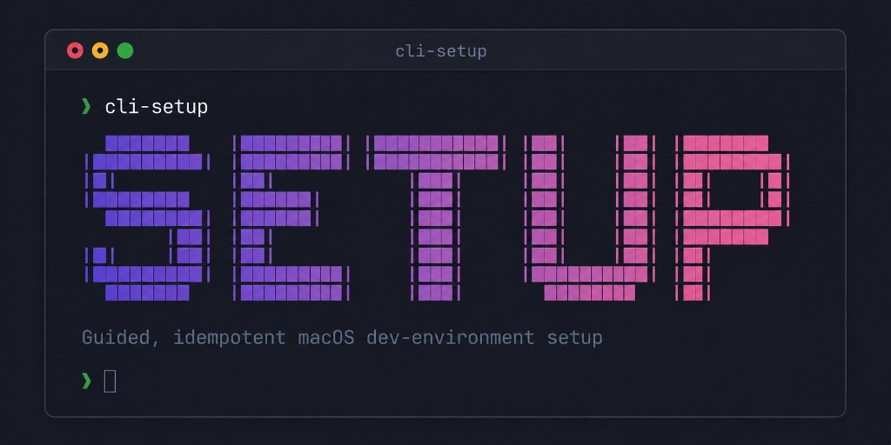

<p align="center">
  
</p>

# cli-setup

> A native Bash CLI for macOS that **diagnoses, installs, and reconciles** a developer's environment — idempotently and guided.

`cli-setup` replaces the long, error-prone onboarding checklist. It figures out
what your machine is missing for a given kind of project, shows you a plan before
touching anything, installs what's needed without re-doing work, and keeps every
machine on the team aligned to the same standard.

> **Status:** early development. The repository is being built milestone by
> milestone; only the CLI skeleton (`--version` / `--help`) works so far — the
> profile commands are planned. See [Roadmap](#roadmap).

## Why

Developers — especially mobile / React Native — lose hours preparing macOS:
many tools, exact versions, shell configuration, GUI apps, and tool-specific
gotchas. Manual guides drift between machines and there's no fast way to see
what's missing, install it idempotently, or reconcile versions to a team
standard. `cli-setup` makes that a single guided command.

## Commands

| Command | What it does | Status |
| --- | --- | --- |
| `cli-setup doctor <profile>` | Read-only diagnosis: report what's missing and any drift. | Planned |
| `cli-setup setup <profile>` | Install the missing tools for a profile; idempotent. | Planned |
| `cli-setup update <profile>` | Reconcile installed tools to the team config. | Planned |
| `cli-setup config <action>` | Manage the team config (`set-team` / `show` / `refresh`). | Planned |
| `cli-setup --version` | Print the installed version. | Available |
| `cli-setup --help` / `-h` | Print usage (also printed with no arguments). | Available |
| `cli-setup --verbose` / `-v` | Turn on detailed output. | Available |

See the
[Command reference](https://isaacisrael.github.io/cli-setup/commands.html) for
the full details. The first profile is `mobile` (React Native, bare workflow —
iOS + Android).

## Installation

> Not yet available. Once released, install with:
>
> ```bash
> curl -fsSL https://example.com/install.sh | bash
> ```
>
> The installer vendors `gum` and `jq` (no Homebrew dependency) into
> `~/.cli-setup` and links the CLI onto your `PATH`. The version is sourced from
> the released tag (stamped into the download); the installer writes it to
> `~/.cli-setup/VERSION`, which `cli-setup --version` reads. There is no
> committed `VERSION` or `CHANGELOG` — the changelog lives in the GitHub Releases.

## Documentation

Full user documentation lives on the
[documentation site](https://isaacisrael.github.io/cli-setup/) (concepts,
command reference, roadmap).

## Contributing

Want to work on the repo? See [CONTRIBUTING.md](CONTRIBUTING.md) for toolchain
setup, conventions, and the pull-request flow.

## Roadmap

Work is delivered in milestones and tracked as GitHub issues. See the
[roadmap](https://isaacisrael.github.io/cli-setup/roadmap.html) for the milestone
plan and the [issue tracker](https://github.com/IsaacIsrael/cli-setup/issues) for
the always-current status.

## License

[MIT](LICENSE) © 2026 Isaac Israel
