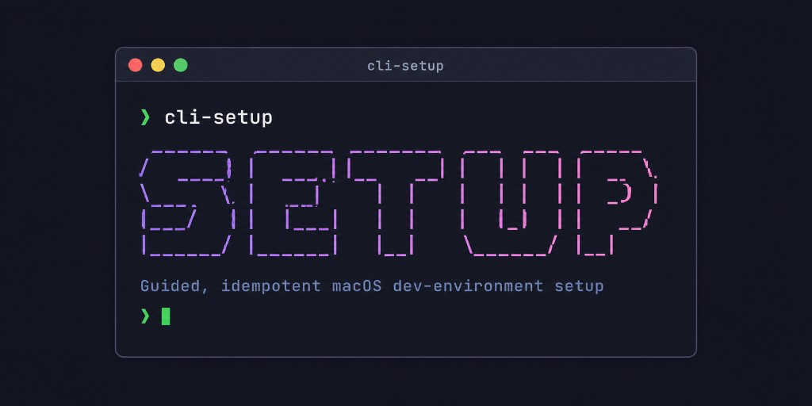

<p align="center">
  
</p>

# cli-setup

> A native Bash CLI for macOS that **diagnoses, installs, and reconciles** a developer's environment — idempotently and guided.

`cli-setup` replaces the long, error-prone onboarding checklist. It figures out
what your machine is missing for a given kind of project, shows you a plan before
touching anything, installs what's needed without re-doing work, and keeps every
machine on the team aligned to the same standard.

> **Status:** early development. The repository is being built milestone by
> milestone; no commands are implemented yet. See [Roadmap](#roadmap).

## Why

Developers — especially mobile / React Native — lose hours preparing macOS:
many tools, exact versions, shell configuration, GUI apps, and tool-specific
gotchas. Manual guides drift between machines and there's no fast way to see
what's missing, install it idempotently, or reconcile versions to a team
standard. `cli-setup` makes that a single guided command.

## Core concepts

| Concept | What it is |
| --- | --- |
| **Tool** | A self-describing, reusable unit that knows how to `check` for and `install` one piece of the environment (e.g. Node, Xcode, Watchman). |
| **Profile** | A named selection of tools that defines an environment to set up (e.g. `mobile`). |
| **Environment** | The set of tools and shell configuration needed to build a given kind of project. |
| **Team config** (a.k.a. *config dist*) | An optional JSON document, published at a URL, that a team uses to pin versions and customize a profile. |
| **Version resolution** | The layered precedence deciding which version to install: flag > project file > team config > profile override > tool default. |
| **Drift** | A divergence between an installed tool and the version or selection the team config expects. |
| **Managed block** | The single demarcated, reversible region that `cli-setup` owns inside your `~/.zshrc`. |

## Planned commands

| Command | Purpose |
| --- | --- |
| `cli-setup doctor <profile>` | Read-only diagnosis: report what's missing and any drift. Changes nothing. |
| `cli-setup setup <profile>` | Install and adjust the missing tools for a profile. Idempotent; re-running resumes. |
| `cli-setup update <profile>` | Reconcile installed tools to the team config when there's drift. |
| `cli-setup config <set-team\|show\|refresh>` | Manage the team config. |

The version and usage are flags, not subcommands: `cli-setup --version` and
`cli-setup --help` / `-h` (running with no arguments also prints help).

Common flags (planned): `--help` / `-h`, `--version`, `--verbose` / `-v`, `--dry-run`, `--yes`, `--team-config <url>`.
Output is silent by default, always writes a log to
`~/.cli-setup/logs/<timestamp>.log` (plus `last.log`), and shows a dependency-tree
preview before applying.

The first profile is `mobile` (React Native, bare workflow — iOS + Android).

## Installation

> Not yet available. Once released, install with:
>
> ```bash
> curl -fsSL https://example.com/install.sh | bash
> ```
>
> The installer vendors `gum` and `jq` (no Homebrew dependency) into
> `~/.cli-setup` and links the CLI onto your `PATH`. The version is sourced from
> the released tag (stamped into the download); the installer writes it to
> `~/.cli-setup/VERSION`, which `cli-setup --version` reads. There is no
> committed `VERSION` or `CHANGELOG` — the changelog lives in the GitHub Releases.

## Project layout

`src/` is the installable payload — everything shipped to `~/.cli-setup`. Tests,
docs, and repo metadata stay outside it.

```
src/              # the installable CLI
  bin/cli-setup   # entrypoint (dispatcher) — symlinked onto PATH
  lib/            # shared Bash helpers (logging, semver, graph resolution)
  tools/          # one folder per tool: <id>/{tool.json, tool.sh}
  profiles/       # one JSON per profile: <id>.json (lists tool ids)
spec/             # ShellSpec tests
docs/             # mdBook documentation site source
install.sh        # curl-able installer (later slice)
.agents/          # agent workspace (skills, rules, domain docs) — see AGENTS.md
```

Full detail, including the planned per-layer responsibilities, lives in
[`.agents/docs/app-layout.md`](.agents/docs/app-layout.md).

## Development

This project uses a native, single-binary toolchain (no Node runtime):

| Concern | Tool |
| --- | --- |
| Lint (code) | [ShellCheck](https://www.shellcheck.net/) |
| Format | [shfmt](https://github.com/mvdan/sh) + `.editorconfig` |
| Tests | [ShellSpec](https://shellspec.info/) |
| Git hooks | [Lefthook](https://github.com/evilmartians/lefthook) |
| Commits / releases | [Cocogitto](https://docs.cocogitto.io/) (`cog`) |
| Task runner | [`just`](https://github.com/casey/just) + `Brewfile` |
| Docs site | [mdBook](https://rust-lang.github.io/mdBook/) |

Bootstrap the toolchain with [Homebrew](https://brew.sh), `brew install just`,
and `just setup` — see [CONTRIBUTING.md](CONTRIBUTING.md) for the step-by-step.
`just setup` installs the `Brewfile` tools and wires the git hooks; run `just`
to list the recipes. The individual `lint`, `fmt`, `test`, and `docs` recipes
fill in over the infrastructure milestone.

> Compatibility target: **Bash 3.2** (the macOS system Bash). Avoid Bash 4+
> features such as associative arrays (`declare -A`).

CI runs each quality gate as a reusable GitHub Actions workflow. Releases are
tag-sourced (the git tag is the single source of truth — no committed `VERSION`
or `CHANGELOG`): feature releases are cut from a draft GitHub Release via the
native "Publish release" button, and `hotfix/*` merges auto-publish a patch
release. The strategy is recorded in
[ADR 0010](.agents/docs/adr/0010-ci-cd-strategy.md); the maintainer setup steps
live in the [CI/CD setup runbook](.agents/docs/ci-cd-setup.md).

## Conventions

- **Commits** follow [Conventional Commits 1.0.0](https://www.conventionalcommits.org/en/v1.0.0/).
- **Branches** are trunk-based, short-lived off `main` (`feature/*`, `bugfix/*`, `hotfix/*`).
- **Language:** all artifacts and user-facing output are in **English**.

## Roadmap

Work is tracked as GitHub issues, grouped into milestones:

1. **Infrastructure** — project setup, toolchain, lint/format/test, CI/CD, docs.
2. **Core** — cross-cutting framework + a tracer-bullet tool.
3. **`doctor mobile`** — diagnosis end-to-end.
4. **`setup mobile` (non-GUI)** — install the automatable tools.
5. **`setup mobile` (GUI)** — guided GUI/assisted tools (Xcode, Android Studio).
6. **Team config + `update`/`config`** — drift reconciliation.

## License

[MIT](LICENSE) © 2026 Isaac Israel
